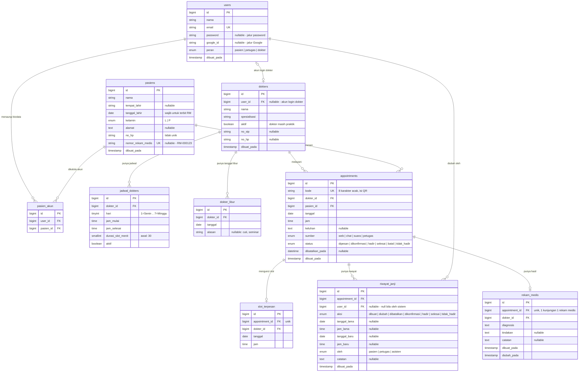

# ERD CAVA — Struktur Data yang Sudah Disepakati

Diagram di bawah memakai **Mermaid**, jadi GitHub merendernya otomatis saat kamu
membuka file ini di browser. Tidak perlu aplikasi tambahan.

Versi ringkas dalam teks ada di bagian bawah, untuk dibaca dari editor biasa.

## Diagram



## Kunci unik yang mengikat

| Tabel | Kunci unik | Fungsinya |
|---|---|---|
| `users` | `email` | satu akun per email |
| `pasiens` | `nomor_rekam_medis` | satu RM per orang, seumur hidup |
| `pasien_akun` | (`user_id`, `pasien_id`) | akun yang sama tidak menaut biodata yang sama dua kali |
| `appointments` | `kode` | kode booking / isi QR tidak boleh bentrok |
| `slot_terpesan` | (`dokter_id`, `tanggal`, `jam`) | **penjaga anti double-booking** |
| `slot_terpesan` | `appointment_id` | satu janji memegang paling banyak satu slot |
| `dokter_libur` | (`dokter_id`, `tanggal`) | satu tanggal libur dicatat sekali |
| `rekam_medis` | `appointment_id` | satu kunjungan punya satu hasil pemeriksaan |

## Relasi dan artinya

- **`users` ↔ `pasiens` (banyak-ke-banyak lewat `pasien_akun`).** Satu akun boleh
  menaungi beberapa biodata (pola Kartu Keluarga), dan satu biodata boleh dikelola
  lebih dari satu akun (dua orang tua, satu anak).
- **`users` ↔ `dokters` (satu-ke-satu, opsional).** Dokter yang bisa login punya
  akun; `user_id` boleh kosong supaya data dokter lama tetap bisa ada tanpa akun.
- **`dokters` → `jadwal_dokters` (satu-ke-banyak).** Pola mingguan berulang.
- **`dokters` → `dokter_libur` (satu-ke-banyak).** Pengecualian tanggal tertentu.
- **`appointments` → `slot_terpesan` (satu-ke-satu).** Baris slot **hanya ada
  selama janjinya aktif**. Dibatalkan = baris slotnya dihapus, sehingga slot itu
  bisa dipesan lagi, sementara baris janjinya tetap tersimpan lengkap dengan
  riwayatnya.
- **`appointments` → `riwayat_janji` (satu-ke-banyak).** Setiap perubahan status
  dan setiap perubahan jadwal meninggalkan satu baris jejak.
- **`appointments` → `rekam_medis` (satu-ke-satu).** Isi pemeriksaan, terpisah
  dari data penjadwalan supaya tidak pernah ikut ter-export ke CSV.

## Tabel bawaan Laravel (bukan bagian rancangan kita)

`migrations`, `cache`, `cache_locks`, `jobs`, `job_batches`, `failed_jobs`,
`sessions`, `password_reset_tokens`, `users`.

Sembilan tabel pertama sudah ada di database `cava` — hasil `php artisan migrate`
di skeleton Laravel 13. **`users` dipakai ulang dan diperluas**, bukan dibuat baru:
tambah `peran` dan `google_id`.

## Versi teks (untuk dibaca dari editor biasa)

```
users ──< pasien_akun >── pasiens
  │                          │
  │                          └──< appointments >── dokters
  │                                    │              │
  │                                    │              ├──< jadwal_dokters
  │                                    │              └──< dokter_libur
  │                                    │
  │                                    ├── slot_terpesan   (1:1, hanya saat aktif)
  │                                    ├──< riwayat_janji  (jejak perubahan)
  │                                    └── rekam_medis     (1:1, TIDAK ikut export CSV)
  │
  └──| dokters   (akun login dokter, 1:1 opsional)
  └──< riwayat_janji  (siapa yang mengubah)
```

## Catatan penting saat membuat migration

1. **Urutan pembuatan tabel mengikuti panah:** `users` → `pasiens`, `dokters` →
   `jadwal_dokters`, `dokter_libur`, `appointments` → `slot_terpesan`,
   `riwayat_janji`, `rekam_medis`, dan `pasien_akun` paling akhir. Tabel yang
   menunjuk tabel lain harus dibuat belakangan.
2. **`dokters` dan `pasiens` tidak pernah dihapus.** Dokter memakai `aktif`;
   pasien dengan janji yang sudah ada tidak boleh dihapus karena riwayatnya ikut
   hilang. Kalau perlu nonaktifkan, bukan hapus.
3. **Semua foreign key diberi perilaku on-delete yang jelas.** Untuk
   `slot_terpesan` dan `riwayat_janji`: ikut terhapus bersama janjinya. Untuk
   `pasiens` dan `dokters`: tolak penghapusan (`restrict`).
4. **`slot_terpesan` bukan tabel turunan yang boleh diisi seeder.** Satu-satunya
   jalan mengisinya adalah lewat `BookingService` yang sama, supaya kunci uniknya
   benar-benar menjaga.
